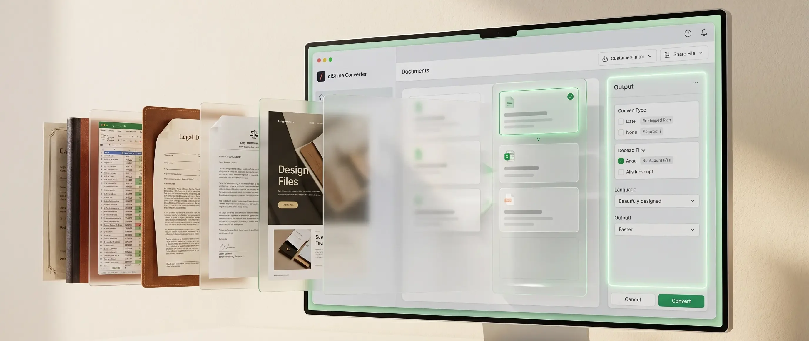
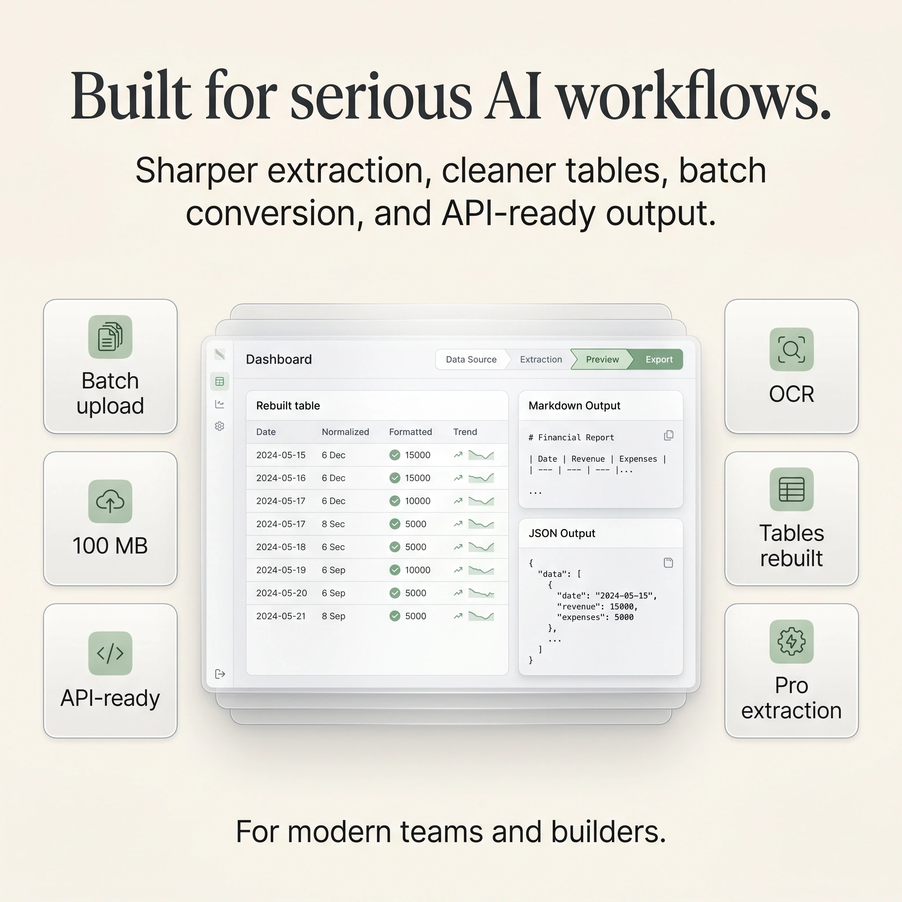

# 📄 Dishine Converter / Data Optimizer — file to Markdown & JSON for LLMs

<div align="center">

[](https://dishine.it/)

***Transform. Automate. Shine!***

[](https://converter.dishine.it/)
[](https://dishine.it/)
[](https://linkedin.com/company/100682596)
[]()
[](LICENSE)
[](CONTRIBUTING.md)

<p align="center">
  
</p>

***Convert PDF, DOCX, PPTX, XLSX, images, HTML and web pages into clean Markdown or JSON — token-efficient, LLM-ready, with a free tier, a REST API, batch uploads and a live token-savings meter.***

**Live site:** [converter.dishine.it](https://converter.dishine.it/) &nbsp;·&nbsp; **Docs:** [converter.dishine.it/docs](https://converter.dishine.it/docs) &nbsp;·&nbsp; **Sister tool:** [prompt.dishine.it](https://prompt.dishine.it/)

</div>

---

## Why this exists

PDFs, slide decks and Office docs are **token-heavy and noisy** when fed to an LLM. A 40-page PDF stripped down to Markdown typically cuts input tokens **5× to 10×** — cheaper context, faster responses, cleaner results.

Dishine Convert gives you:

- **One pipe**: drop a file (or paste a URL), get Markdown or JSON back.
- **AI extraction** powered by vision-capable models — tables, invoices, slide layouts are reconstructed, not flattened.
- **LLM-native output**: GitHub-Flavored Markdown *or* schema-validated JSON (tool-calling compatible).
- **Token savings visible on every run**: input vs output tokens, % saved, compression ratio.
- **Free tier, no signup**: 5 conversions per day, 20 MB file cap.
- **Pro tier**: 500 conversions / rolling 30 days, 100 MB files, batch upload (25 files), Firecrawl rendering for JS-heavy URLs, REST API access.
- **Trilingual UI**: English, Italian, French.
- **Private by default**: files processed in-memory inside an edge function, never stored. Only filename, size and format are logged. Row-Level-Security isolates every user's history and keys.

<div align="center">

<p align="center">
  
</p>

</div>

---

## Table of contents

- [Features](#features)
- [Supported input formats](#supported-input-formats)
- [Output formats](#output-formats)
- [Quick start (hosted)](#quick-start-hosted)
- [Quick start (REST API)](#quick-start-rest-api)
- [Self-hosting](#self-hosting)
- [Project structure](#project-structure)
- [Documentation](#documentation)
- [Tech stack](#tech-stack)
- [Roadmap](#roadmap)
- [Contributing](#contributing)
- [Security](#security)
- [License](#license)
- [Credits](#credits)

---

## Features

| | |
|---|---|
| **🧠 AI extraction** | Gemini-powered vision pipeline reconstructs tables, invoices, slide layouts, and handwriting. |
| **📥 16 input formats** | PDF, DOCX, PPTX, XLSX, TXT, CSV, HTML, XML, JSON, YAML, MD, PNG, JPG, JPEG, WEBP, GIF (and more). |
| **📝 Markdown *or* JSON** | GitHub-Flavored Markdown *or* schema-validated JSON via tool calling. |
| **🌐 URL to Markdown** | Paste any URL, get clean Markdown. Free tier uses plain HTTP; Pro uses Firecrawl for JS-heavy SPAs and bot-protected sites. |
| **🎁 Use as AI prompt** | One click wraps the output in a ready-to-paste prompt for ChatGPT, Claude or Gemini. |
| **📊 Live token savings** | Every run shows input vs output tokens, percent saved, and compression ratio. |
| **📦 Batch upload (Pro)** | Drop up to 25 files at once, parallel queue with live status, single-zip download. |
| **🗂️ Conversion history** | Per-account history, searchable, re-downloadable. |
| **🌍 Trilingual** | Full EN / IT / FR interface and documentation. |
| **🔐 Private by default** | In-memory processing, no file storage, RLS-isolated accounts, instant API-key revoke. |
| **🔑 REST API** | `POST /v1/convert` and `POST /v1/fetch-url` with Bearer authentication, per-key logs, 30 req/min per IP, 500 conversions/month Pro. |

---

## Supported input formats

| Category | Formats |
|---|---|
| **Documents** | `pdf`, `docx`, `pptx`, `xlsx` |
| **Plain text** | `txt`, `md`, `csv`, `tsv` |
| **Markup** | `html`, `htm`, `xml` |
| **Structured** | `json`, `yaml`, `yml` |
| **Images** *(OCR)* | `png`, `jpg`, `jpeg`, `webp`, `gif` |
| **Web** | Any URL — plain HTTP (Free) or Firecrawl-rendered (Pro) |

> The vision model handles scanned PDFs, handwriting, and complex layouts. Plain-text inputs skip the model and go through a deterministic parser.

---

## Output formats

- **Markdown** — GitHub-Flavored, with tables, code blocks, ATX headings, preserved emphasis.
- **JSON** — schema-validated via tool-calling, deterministic key order, parser-safe.

---

## Quick start (hosted)

1. Open [converter.dishine.it](https://converter.dishine.it/)
2. Drop a file (or paste a URL)
3. Pick **Markdown** or **JSON**
4. Download, copy, or click **Use as AI prompt** to send it straight to your LLM

Free tier = 5 conversions a day, no signup needed.

Need more? Create a free account, then upgrade to **Pro** for unlimited conversions, batch upload, Firecrawl URL rendering, bigger files, and REST API access.

---

## Quick start (REST API)

```bash
# 1. Create an API key from your account page → API keys → Generate
export DISHINE_KEY="dsh_pro_…"

# 2. Convert a file
curl -sS -X POST https://converter.dishine.it/v1/convert \
  -H "Authorization: Bearer $DISHINE_KEY" \
  -H "Content-Type: multipart/form-data" \
  -F "file=@invoice.pdf" \
  -F "format=markdown"

# 3. Convert a URL
curl -sS -X POST https://converter.dishine.it/v1/fetch-url \
  -H "Authorization: Bearer $DISHINE_KEY" \
  -H "Content-Type: application/json" \
  -d '{"url":"https://example.com/article","format":"json"}'
```

**Response shape (both endpoints):**

```json
{
  "output": "...",
  "format": "markdown",
  "tier": "pro",
  "model": "gemini-2.5-pro"
}
```

- **Auth:** `Authorization: Bearer <key>` — keys are generated in your account page.
- **Rate limit:** 30 requests / minute per IP (best-effort, per edge instance).
- **Monthly cap:** 500 conversions / rolling 30 days per Pro account.
- **File size:** 20 MB (Free) · 100 MB (Pro).
- **Per-key usage logs & instant revoke** from your account page.

See [API.md](API.md) for every parameter, error code, and language examples (Node, Python, PHP, Go, curl).

---

## Self-hosting

Dishine Convert is a **React SPA** backed by **Supabase** (auth, DB, edge functions). You can self-host the whole thing on any static host + your own Supabase project.

Minimal stack:

- **Hosting:** any static host (Vercel, Netlify, Cloudflare Pages, Nginx…)
- **Backend:** Supabase (auth, Postgres with RLS, edge functions running on Deno)
- **AI:** Google Gemini API key (`gemini-2.5-flash` for Free & small files, `gemini-2.5-pro` for Pro & large files) — any OpenAI-compatible gateway works too (`AI_GATEWAY_URL`)
- **URL rendering (optional):** Firecrawl API key (only needed for the Pro "JS-heavy URL" path)
- **Payments (optional):** Stripe secret + webhook secret (only if you want paid tiers)
- **Email (optional):** any SMTP provider (only for magic-links and Stripe receipts)

Full walkthrough: **[DEPLOY.md](DEPLOY.md)**.

Quick environment setup:

```bash
cp .env.example .env
# fill in SUPABASE_*, GEMINI_API_KEY, and optional FIRECRAWL_API_KEY / STRIPE_*
pnpm install
pnpm dev        # front-end on :5173
supabase start  # local Supabase stack
supabase functions deploy convert-file fetch-url
```

---

## Project structure

```
.
├── README.md                  ← you are here
├── API.md                     ← REST API reference
├── TECHNICAL.md               ← architecture + module reference
├── DEPLOY.md                  ← self-hosting + Supabase setup
├── CONTRIBUTING.md
├── CODE_OF_CONDUCT.md
├── SECURITY.md
├── CHANGELOG.md
├── LICENSE                    ← MIT
├── .env.example
├── .github/
│   ├── ISSUE_TEMPLATE/
│   ├── PULL_REQUEST_TEMPLATE.md
│   └── workflows/             ← CI (lint, typecheck, build, Deno check)
├── _wiki-pages/               ← trilingual long-form docs (EN / IT / FR)
├── docs/
│   └── openapi.yaml           ← OpenAPI 3.1 spec for /v1 endpoints
├── public/                    ← favicons, manifest, social image
├── src/                       ← React front-end
│   ├── pages/                 ← Home, Docs, Account, Auth, Checkout…
│   ├── components/
│   ├── hooks/
│   ├── lib/
│   └── i18n/                  ← en.json, fr.json, it.json
└── supabase/
    ├── config.toml
    ├── migrations/            ← SQL schema + RLS policies
    └── functions/
        ├── convert-file/      ← file → Markdown/JSON (vision pipeline)
        ├── fetch-url/         ← URL → Markdown/JSON (plain HTTP + Firecrawl)
        └── _shared/           ← shared helpers (auth, rate-limit)
```

---

## Documentation

| Document | What it covers |
|---|---|
| **[API.md](API.md)** | Every endpoint, parameter, error code, and language examples. |
| **[TECHNICAL.md](TECHNICAL.md)** | Architecture, conversion pipeline, model routing, front-end module reference. |
| **[DEPLOY.md](DEPLOY.md)** | Step-by-step self-hosting with Supabase, Stripe, and your own Gemini key. |
| **[CONTRIBUTING.md](CONTRIBUTING.md)** | PR workflow, commit conventions, testing, translation contributions. |
| **[SECURITY.md](SECURITY.md)** | Vulnerability disclosure policy, data model, privacy notes. |
| **[CHANGELOG.md](CHANGELOG.md)** | Version history. |
| **[Wiki](../../wiki)** (GitHub) | Trilingual long-form documentation — EN · IT · FR. |
| **[docs/openapi.yaml](docs/openapi.yaml)** | Machine-readable OpenAPI 3.1 spec. |

---

## Tech stack

| Layer | Tool |
|---|---|
| **Front-end** | React 18, Vite, TypeScript, Tailwind CSS, shadcn/ui, TanStack Query, i18next |
| **Auth + DB + Functions** | Supabase (Postgres, Row-Level Security, Deno-runtime edge functions) |
| **AI extraction** | Google Gemini — `gemini-2.5-flash` (Free / small files), `gemini-2.5-pro` (Pro / large files). Any OpenAI-compatible gateway is supported. |
| **URL rendering** | Plain HTTP (Free) + Firecrawl (Pro, JS-heavy / bot-protected sites) |
| **Payments** | Stripe Checkout + customer portal |
| **Analytics** | Privacy-first, cookie-free (Plausible-compatible; see [DEPLOY.md](DEPLOY.md#analytics)) |
| **Hosting** | Any static host (Vercel / Netlify / Cloudflare Pages / Nginx) + Supabase |

---

## Roadmap

- [ ] Webhook callbacks for async large-file conversions
- [ ] Native browser extension (right-click → convert)
- [ ] Notion, Confluence, Google Drive connectors
- [ ] Scheduled re-crawl (monitor a URL's changes over time)
- [ ] Embeddings pre-computation (output Markdown + vector in one call)
- [ ] Self-host Docker Compose bundle
- [ ] Community-submitted JSON schemas (invoice, receipt, resume…)

Contributions welcome — see **[CONTRIBUTING.md](CONTRIBUTING.md)**.

---

## Contributing

Pull requests are welcome! High-value contributions:

- **Language translations** — improve EN/IT/FR copy, or add a new locale
- **New input formats** — a parser for `.epub`, `.rtf`, `.odt`…
- **Edge-function optimizations** — faster PDF passes, cheaper prompts
- **JSON schemas** — opinionated schemas for common document types (invoice, receipt, contract, resume)
- **Documentation fixes** — typos, clarifications, examples

Read **[CONTRIBUTING.md](CONTRIBUTING.md)** before opening a PR.

---

## Security

- **Responsible disclosure:** see **[SECURITY.md](SECURITY.md)**
- **Row-Level Security** isolates every user's conversion history and API keys
- **In-memory processing** — files are never persisted to object storage
- **API keys** are stored hashed; the raw key is shown once on creation and never again
- **Stripe** handles all payment data — the app never sees card numbers
- Report vulnerabilities privately to **security@dishine.it**

---

## License

**MIT** — see [LICENSE](LICENSE).

You're free to use, fork, host, and modify Dishine Convert for personal or commercial use. Attribution appreciated but not required.

---

## Credits

Built by **[diShine Digital Agency](https://dishine.it)** — Milan · Toulouse · Nice.

Founder: **[Kevin Escoda](https://kescoda.com)**.

Sister tool: **[prompt.dishine.it](https://prompt.dishine.it/)** — the Prompt Workshop for prompt engineering and token reduction.

<div align="center">

*If Dishine Convert saves you tokens, a star ⭐ means the world.*

</div>
